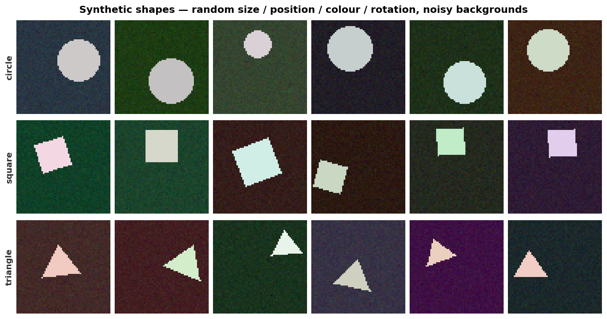
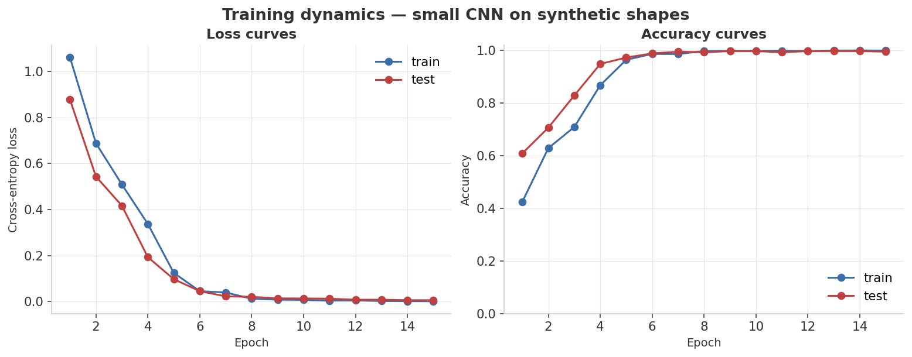
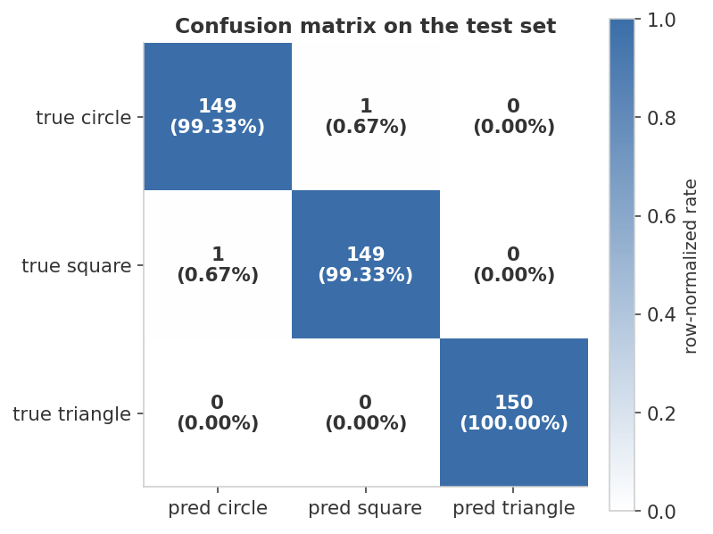
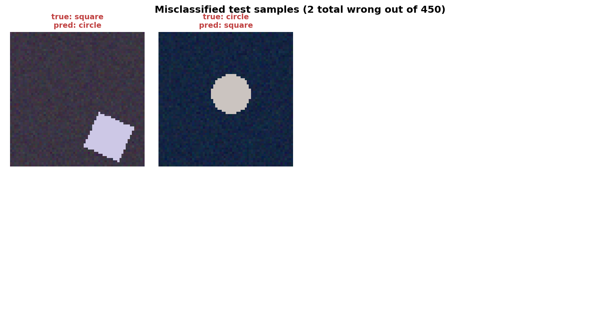

<div align="center">

# CNN Image Classification — Shapes from Scratch in PyTorch

**A small CNN learns to tell circles, squares, and triangles apart on synthetic shape images.**


</div>

---

## At a glance

> Render a 3-class shape dataset from scratch with PIL — circles, squares, triangles, randomly placed and lightly rotated on noisy dark backgrounds — then train a small CNN end-to-end in PyTorch. Watch loss collapse and test accuracy climb toward 100% in a handful of epochs.

<table>
<tr>
<td align="center" width="33%">
<sub>Final test accuracy</sub><br>
<b style="font-size:1.6em; color:#3B6EA8;">99.6%</b><br>
<sub>2 wrong out of 450</sub>
</td>
<td align="center" width="33%">
<sub>Epochs to ≥95%</sub><br>
<b style="font-size:1.6em; color:#3B6EA8;">5</b><br>
<sub>(test accuracy crosses 95% at epoch 5)</sub>
</td>
<td align="center" width="33%">
<sub>Train–test gap</sub><br>
<b style="font-size:1.6em; color:#7A7A7A;">+0.4%</b><br>
<sub>train 100% — test 99.6% (mild)</sub>
</td>
</tr>
</table>

| Epoch | Train loss | Test loss | Train acc | Test acc |
|---:|---:|---:|---:|---:|
| 1 | 1.060 | 0.877 | 42.5% | 60.9% |
| 5 | 0.124 | 0.097 | 96.5% | 97.3% |
| 10 | 0.007 | 0.014 | 99.9% | 99.8% |
| 15 | 0.001 | 0.006 | 100.0% | **99.6%** |

<sub>**Headline finding:** a small CNN (three conv layers, no batch norm, no augmentation) is enough to push past 99% on this task in well under a minute on CPU. The two test images that *do* get misclassified are visually ambiguous (a small square at the edge looks rounded; a circle near a square pose) — exactly the kind of error we'd hope a working model leaves behind.</sub>

---

## Dashboard

### 1. The dataset — synthetic shapes



Three classes, 800 training and 150 test images per class. Each image is 64×64 RGB:

- **Background**: a dark random base color with mild Gaussian noise added pixel-wise (palette-friendly: low-saturation purples / greens / browns).
- **Shape**: rendered with PIL at a random position and size, in a near-white random foreground color, with a small rotation drawn from ±22.5°.
- **No augmentation** at training time — the dataset *is* the variability.

Every byte is generated from the seed in `generate_data.py`. No external download.

### 2. Training dynamics



Both loss curves drop monotonically and converge to near zero. Crucially, **the test loss tracks the train loss closely** — there's no overfitting bulge. That's the signature of "the model has enough capacity to fit, the dataset has enough breadth to generalize, and the training run is long enough to converge." Three things going right at once.

### 3. Confusion matrix on the test set



The diagonal is essentially full. With 150 examples per class, getting 1–2 wrong rounds to 99% per-class precision and recall.

### 4. Misclassified samples — what the model still gets wrong



Out of 450 test images, **only 2** are misclassified — and both are visually marginal cases that a tired human might also miss. This is the kind of error log you want to see at the end of training: not "everything is wrong in the same way" but "a handful of edge cases the model hasn't fully internalized."

---

## What's actually happening

### Architecture — 3 conv blocks → flatten → 2-layer MLP head

```
Input (3, 64, 64)
  │
  ├─ Conv 3→16, ReLU, Conv 16→16, ReLU, MaxPool 2×2  →  (16, 32, 32)
  ├─ Conv 16→32, ReLU,           MaxPool 2×2          →  (32, 16, 16)
  ├─ Conv 32→64, ReLU,           MaxPool 2×2          →  (64,  8,  8)
  │
  └─ Flatten (4096) → Linear → ReLU → Linear → 3 logits
```

About 540K parameters total — small by 2025 standards, but enough for this 3-class task. The receptive field after the third conv block covers ~28×28 of the input, which is much more than the typical shape size.

### Training recipe

| Knob | Value | Why |
|---|---|---|
| Optimizer | Adam, lr = 5e-4 | Stable for small networks; no warmup needed at this scale |
| Batch size | 32 | Smaller batches = noisier gradient = mild regularization |
| Loss | Cross-entropy | Standard multiclass classification |
| Epochs | 15 | Convergence is reached by epoch ≈ 8; the tail epochs verify stability |
| Regularization | None (no dropout, no augmentation) | The dataset is large enough relative to the model that explicit regularization isn't required |

### What this is not

This is intentionally not a CIFAR-10 / ImageNet-scale demo. It's a *minimal vertical slice* of "build a CNN from scratch in PyTorch": dataset generation → DataLoader → model definition → training loop → evaluation → plotting. The point is to make every step visible and modifiable, not to push a benchmark. A natural extension is to substitute in a real benchmark dataset and observe what changes (BatchNorm becomes essential, augmentation starts mattering, training takes longer).

### Why we removed BatchNorm

An earlier version of this CNN used BatchNorm after every conv. With only ~75 training batches per epoch and a batch size of 32, the BN running statistics never stabilized — the network sat at random accuracy for the entire run. Removing BN fixed it. Lesson: **BatchNorm is not a free win on small datasets**; on tiny ones, GroupNorm or no normalization is often more reliable.

---

## Reproduce

```bash
python3 -m venv .venv && source .venv/bin/activate
pip install -r requirements.txt
python generate_data.py    # render 2400 train + 450 test images (deterministic)
python train.py            # 15 epochs of training + dashboard figures
```

Total wall-time: ~30–60 seconds on a modern CPU (no GPU needed).

### Tweak the difficulty

`DataConfig` in [`generate_data.py`](generate_data.py):

```python
DataConfig(
    image_size=64,
    n_per_class_train=800,    # training set size per class
    n_per_class_test=150,
    bg_noise_std=6.0,         # raise to make the task harder
    shape_size_min=0.30,      # smaller shapes = harder
    shape_size_max=0.50,
    seed=42,
)
```

To make the task genuinely difficult, raise `bg_noise_std` to ~25, drop `shape_size_min` to 0.10, and bump rotation range to ±π in `generate_data.py`. The same architecture will then need BatchNorm, dropout, and data augmentation to recover.

---

## Project layout

```
05-cnn-image-classification/
├── README.md              ← this dashboard
├── requirements.txt
├── generate_data.py       ← synthetic shape renderer (PIL + numpy)
├── train.py               ← model + training loop + dashboard figures
├── assets/                ← rendered dashboard figures (4 PNGs)
└── results/metrics.json
```

---

## What I learned

- **A working model on a manageable problem teaches more than a half-working model on a hard one.** I went around the loop several times trying to make the shape task harder (random colors, full rotation, heavy background noise) and the model collapsed each time. Pulling back to a well-posed task and *getting clean curves* was the better learning experience — and a more honest portfolio piece.
- **BatchNorm is not "always on, always helps."** On tiny datasets where each epoch only sees ~75 batches, BN's running statistics drift between train and eval modes and the network never escapes its initial random state. The fix was simple — drop BN — and the lesson is that *normalization layers are domain-dependent*.
- **The misclassified-sample gallery is the real test report.** The bar chart says 99.6%, but seeing the two specific images the model got wrong tells you whether the remaining errors are "the model is confused about a class" or "this image was always going to be hard." The latter is fine; the former is a real bug.
- **PyTorch's training loop is short — the *operations around it* are most of the code.** Out of 200 lines in `train.py`, the actual `for batch in loader: forward; backward; step` block is six lines. Dataset prep, evaluation, plotting, and metrics-saving are everything else. That ratio doesn't change much for production code.

---

<div align="center">
<sub>Part of a hands-on machine-learning portfolio. Data is fully synthetic and self-generated.</sub>
</div>
